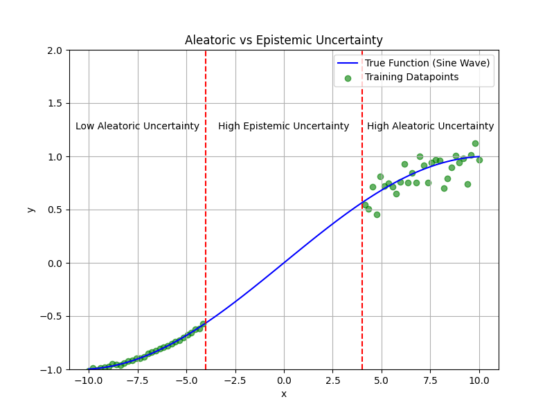
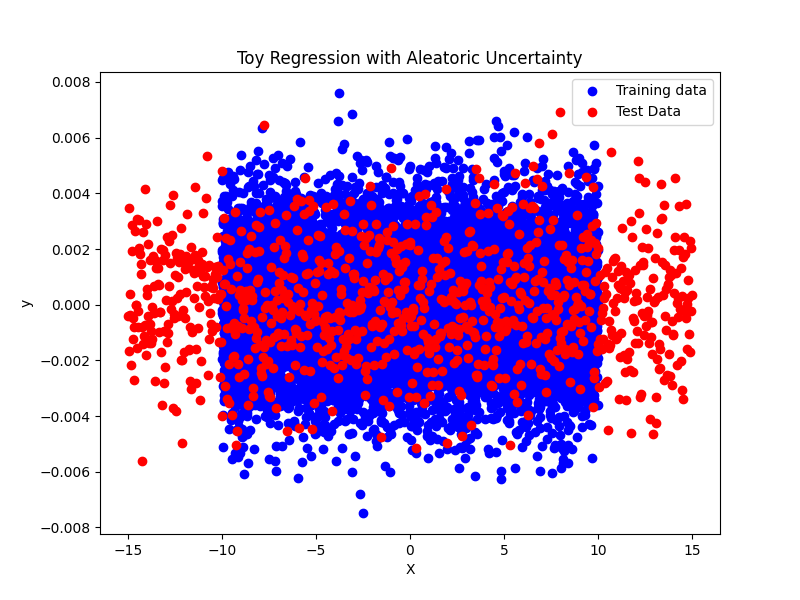
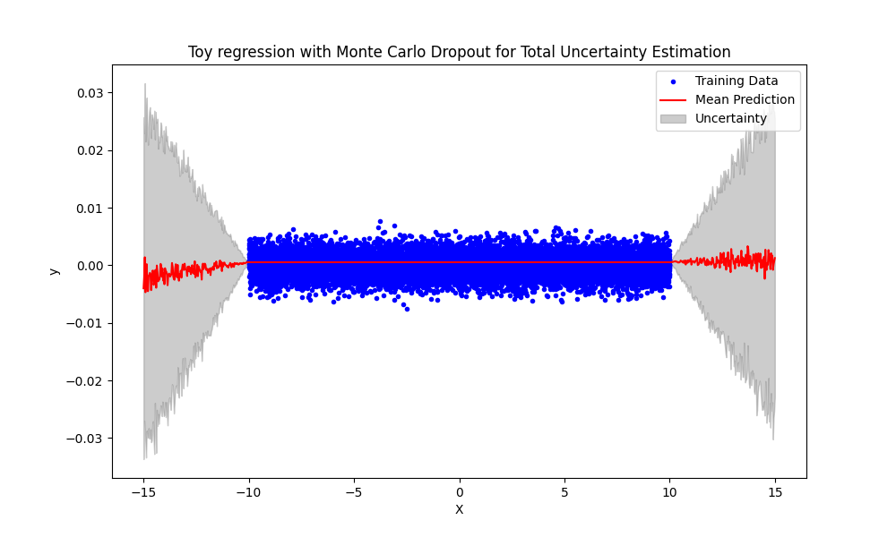
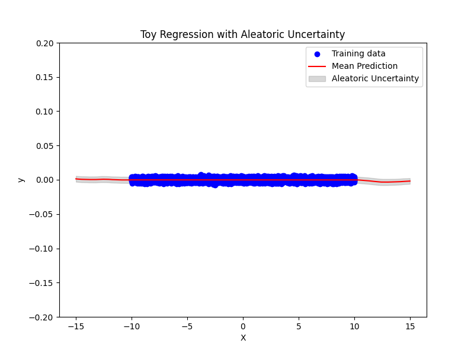
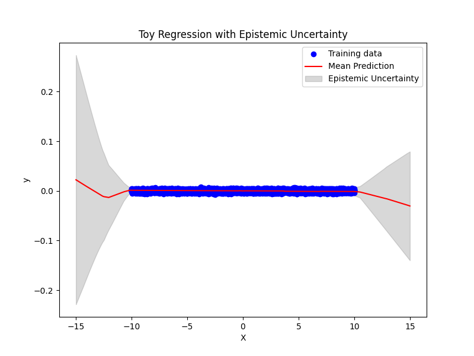
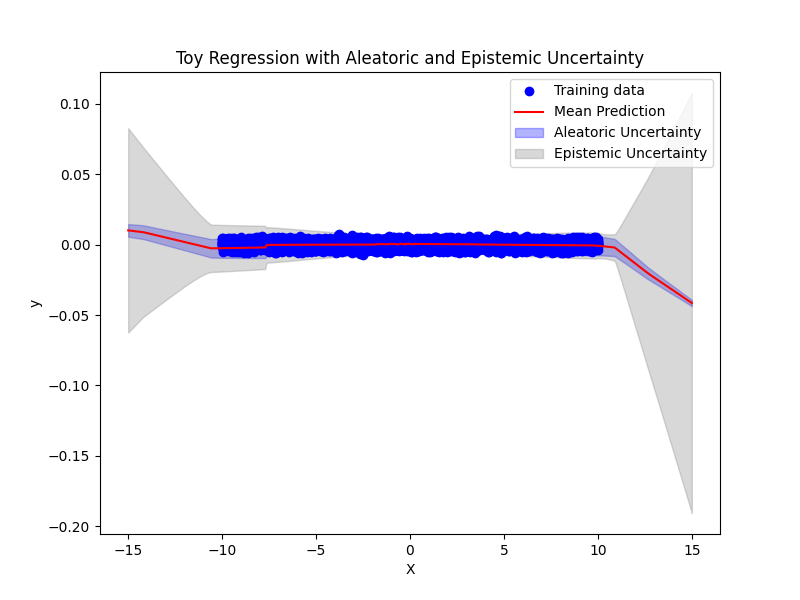

# **Probabilistic Machine Learning**
This repository explores different techniques to estimate the two types of uncertainties in Machine Learning.

---

## **Types of uncertainty**
In machine learning, uncertainty is broadly categorized into aleatoric uncertainty and epistemic uncertainty.



### **Aleatoric Uncertainty**
Aleatoric uncertainty arises from the inherent randomness or noise in the data itself. This type of uncertainty is irreducible, meaning it cannot be eliminated by collecting more data or refining the model. It captures variability due to factors such as measurement errors, sensor inaccuracies, or intrinsic randomness in the observed phenomena.

* Example: In medical imaging, aleatoric uncertainty might stem from artifacts in X-ray images or variability in image quality.


### **Epistemic Uncertainty**
Epistemic uncertainty arises from a lack of knowledge about the model or data. It reflects uncertainty due to insufficient training data or limitations in the model's capacity to generalize. Unlike aleatoric uncertainty, epistemic uncertainty is reducible and can be minimized by incorporating more diverse and representative data or improving the model architecture.

* Example: If a model trained to classify images of cats and dogs has seen only a limited variety of cat breeds, its epistemic uncertainty will be high for unseen breeds.

---

## **Toy Regression**
Toy regression can help in better conceptual understanding, visualisation and interpretation and can also help in the validation of models and methods. In this project, a simple training dataset of 10,000 data points is considered. The ground truth y is distributed according to Gaussian distribution N(0, 0.00004) and the input feature x is linearly spaced between 10 and -10. The data is visualised in the figure below.



The test dataset is similarly distributed but contains 1000 data points and the input feature is linearly spaced between -15 and 15. The range was extended to see the performance of the methods on Out-of-the-Distribution (OOD) data with similar characteristics.

The uncertainty quantification methods will be tested on this dataset. An MLP with two layers will be used for regression with each Uncertainty Quantification method.

---

## **Uncertainty Quantification Methods**
The following methods are explored in this project to measure the two kinds of uncertainty:

### **Monte Carlo Dropout**
Monte Carlo (MC) Dropout is a method that uses dropout—a regularization technique—to approximate Bayesian inference in neural networks. During training, dropout randomly disables neurons to prevent overfitting. For uncertainty quantification, dropout is applied during inference, and the model is run multiple times with different dropout masks to generate a distribution of predictions.

* Provides epistemic uncertainty estimates.



### **Gaussian Approximation**
This method models the output as a Gaussian distribution, allowing the model to predict both the mean and variance of the target variable. The Gaussian Negative Log Likelihood (GNLL) loss function is used during training to optimize both parameters.

* Provides aleatoric uncertainty estimates.



### **Ensembling**
Ensembling combines predictions from multiple models trained independently. By aggregating outputs, it captures epistemic uncertainty through the variance across models.

* Provides epistemic uncertainty estimates.



### **Gaussian Ensembles**
This method integrates ensembling with Gaussian approximation, enabling simultaneous estimation of aleatoric and epistemic uncertainties. Each model predicts a Gaussian distribution, and ensemble predictions are aggregated.

* Provides comprehensive uncertainty estimates (aleatoric + epistemic).



---

## **Evaluation Metrics**
To assess the performance of UQ methods, metrics like Expected Calibration Error (ECE) and reliability plots (RP) are used. 

* ECE measures the alignment between predicted confidence intervals and observed accuracy
* Reliability plots visualize calibration across confidence levels

---

## **Project Structure**
```bash
streamlit-deployment/
├── Code/                     
│   ├── ECE.py                          # Code for calculating Expected Calibration Error (ECE) and parameters for Reliability Plot (RP)
│   ├── Ensemble.py                     # Implementation of Toy Regression with ensemble method
│   ├── Gaussian_Approximation.py       # Implementation of Toy Regression with Gaussian Approximation method
│   ├── Gaussian_Ensembles.py           # Implementation of Toy Regression with Gaussian Ensemble method
│   └── MC_Dropout.py                   # Implementation of Toy Regression with Monte-Carlo Dropout method
├── Figures/                            # Folder used to store figures used in the documentation
│   ├── Ensemble.png
│   ├── Gaussian_Approximation.png
│   ├── Gaussian_Ensembles.png
│   ├── Monte_Carlo_Dropout.py
│   ├── Toy_Dataset.png
│   └── Types_of_Uncertainty.png           
└── README.md                           # Project documentation
```

---

This project was a small part of my Master Thesis Research Project: 'Uncertainty-Aware Lateral Velocity Estimation for Truck-trailer Combination using Deep Learning'.

Thank you for reading!